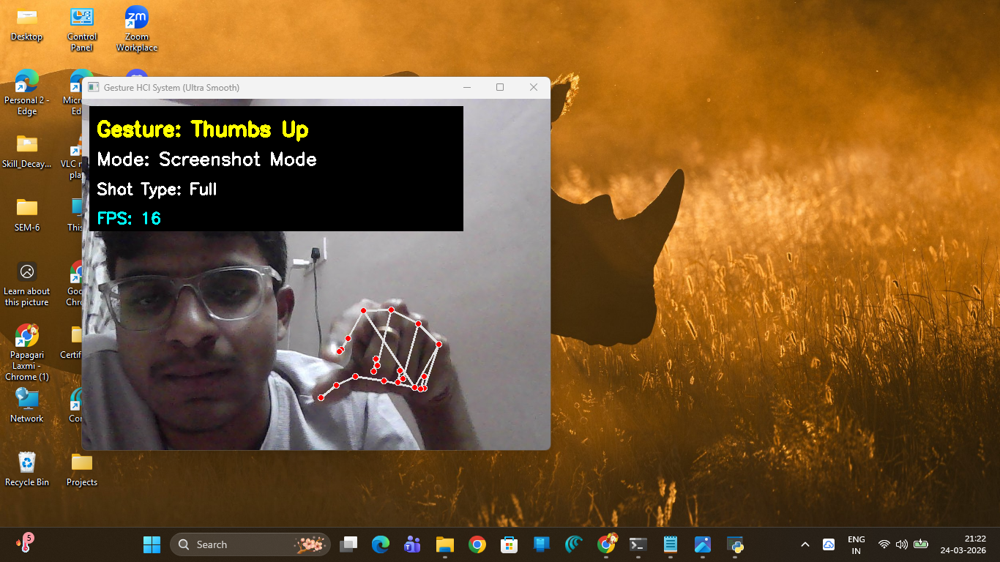

# 🖐️ Gesture HCI System

> A real-time hand gesture recognition system that lets you control your computer — mouse, volume, and screenshots — using nothing but your hand.



---

## ✨ Features

| Gesture | Action |
|---|---|
| ✊ **Fist** | Activates **Mouse Mode** — move cursor with your index finger |
| 🖐️ **Open Palm** | Returns to **Normal Mode** |
| ✌️ **Peace** | Activates **Volume Mode** — spread fingers to raise, pinch to lower |
| 👍 **Thumbs Up** | Activates **Screenshot Mode** |
| 👆 **Point** | Captures a screenshot (in Screenshot Mode) |

- **Ultra-Smooth Mouse Control** — Exponential Moving Average (EMA) smoothing eliminates jitter
- **Gesture Stability Buffer** — 7-frame majority-vote buffer prevents accidental triggers
- **Audible Feedback** — Beep sound confirms every screenshot capture
- **Live HUD** — Real-time display of gesture, active mode, shot type, and FPS

---

## 🛠️ Tech Stack

- **Python 3.x**
- **OpenCV** — webcam capture & frame rendering
- **MediaPipe** — 21-point hand landmark detection
- **PyAutoGUI** — mouse control & screenshot capture
- **NumPy** — distance calculations & interpolation
- **Winsound** — audio feedback (Windows)

---

## 🚀 Getting Started

### Prerequisites

```bash
pip install opencv-python mediapipe pyautogui numpy
```

> **Note:** `winsound` is built into Python on Windows — no extra install needed.

### Run

```bash
python gesture.py
```

Press **`ESC`** to exit.

---

## 🎮 How It Works

```
Webcam Frame
    │
    ▼
MediaPipe Hand Detection (21 landmarks)
    │
    ▼
Finger State Analysis  ──►  Gesture Buffer (7 frames)
    │                              │
    │                        Stable Gesture
    ▼                              │
Mode Switch ◄──────────────────────┘
    │
    ├── Mouse Mode    →  EMA-smoothed cursor movement + click
    ├── Volume Mode   →  Thumb-index distance → volume up/down
    └── Screenshot Mode → Capture full screen → save to /screenshots
```

---

## 📁 Project Structure

```
gesture-recognition/
├── gesture.py          # Main application
├── assets/
│   └── demo.png        # Demo screenshot
└── screenshots/        # Auto-saved gesture-triggered screenshots
```

---

## 📸 Demo

The system overlays live hand landmarks on the webcam feed and displays the current gesture, active mode, and FPS in real time. All screenshots taken via gestures are saved automatically to the `screenshots/` folder with a timestamp-based filename.

---


## 📄 License

[MIT](https://choosealicense.com/licenses/mit/)
